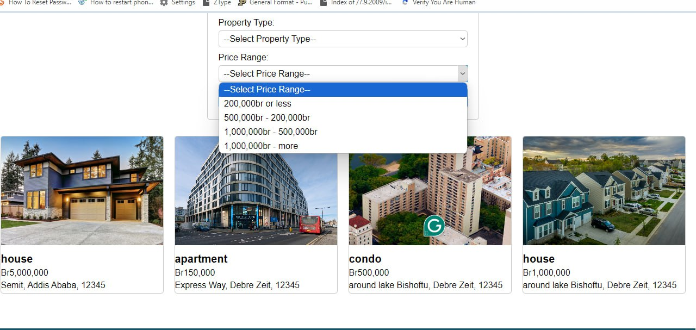
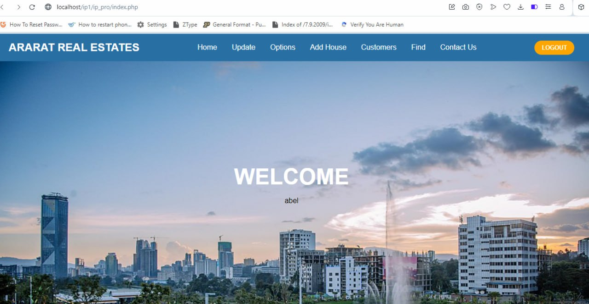
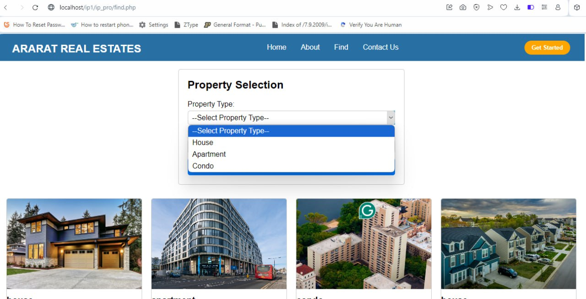
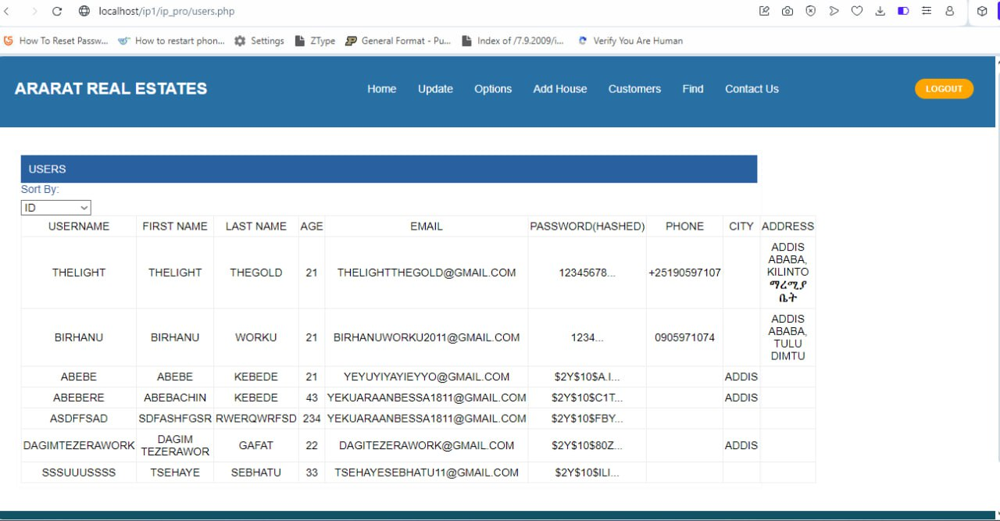
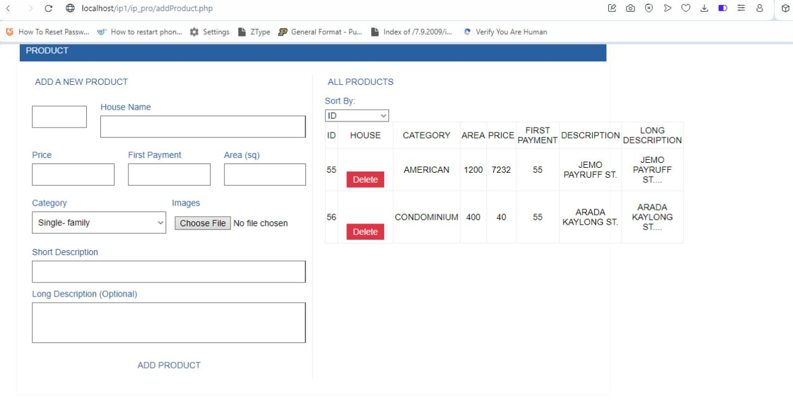

# Ararat Real Estate Project

## Description

The Ararat Real Estate Project is a web application designed to streamline property management and facilitate real estate transactions for Ararat, a leading real estate company. The platform caters to two types of users:

- Regular Users: Individuals seeking to browse, search, and purchase properties.
- Administrators: Managers responsible for overseeing property listings, user accounts, and inquiries.

With a focus on a user-friendly interface and robust functionality, the Ararat platform bridges the gap between buyers and real estate administrators.

---

## Features

### For Regular Users:

- User Registration & Login: Create personalized accounts for managing searches and purchases.
- Property Listings: Browse and filter apartments based on location, price, size, and budget.
- Purchase Functionality: Securely purchase properties directly through the platform.
- Favorites: Save properties to a favorites list for easy access later.
- Advanced Search: Use detailed filters like bedrooms, bathrooms, and amenities to find the perfect property.

### For Administrators:

- Admin Dashboard: Manage property listings, inquiries, and user accounts.
- User Management: Approve or reject user registrations and inquiries.
- Content Management: Update property details, add new listings, and upload images.
- Reporting: View reports on property sales, user activity, and other key metrics.
- Email Notifications: Use the integrated email system to notify users about property updates or inquiries.

---

## Table of Contents

1. [Installation](#installation)
2. [Usage](#usage)
3. [Contributing](#contributing)
4. [Screenshots](#screenshots)
5. [Code of Conduct](#code-of-conduct)
6. [License](#license)

---

## Installation

Follow these steps to set up the project locally:

1. Clone the repository:

   ```
   git clone https://github.com/bezu3007/RealEstate-Website-PHP.git
   ```

2. Navigate to the project directory:
   ```
   cd realstate-website-PHP
   ```
3. Import the database:
   Locate the data_b.sql or gmmd.sql file in the project directory.
   Import it into your MySQL database using a tool like phpMyAdmin or via the command line:
   ```
   mysql -u [username] -p [database_name] < data_b.sql
   ```
4. Configure the project:
   Open the functions folder and locate the configuration file (e.g., db_connect.php).
   Update the database connection details (host, username, password, dbname) to match your setup.
5. Start a local server:
   Use a tool like XAMPP, WAMP, or MAMP to run the project on a local server.
   Place the project folder inside the htdocs directory (for XAMPP) or the equivalent directory for your server.
6. Open your browser and navigate to:

   http://localhost/realestate-website-php

---

## Usage

### For Users:

- Register an account or log in using your credentials.
- Browse the available properties on the homepage or search using filters.
- Add properties to your favorites list or proceed to purchase directly.

### For Administrators:

- Log in using admin credentials.
- Navigate to the Admin Dashboard to manage property listings, user accounts, and inquiries.
- View sales reports and monitor user activity.

---

## Contributing

We welcome contributions from the community to improve this project. Please follow the steps below:

1. Fork the repository:

   - Click the "Fork" button on this repository to create your own copy.

2. Create a feature branch:
   git checkout -b feature-name
3. Make Your Changes:

   Implement your feature or bug fix.
   Write clear and concise commit messages.

4. Push to your branch:
   git push origin feature-name
5. Submit a Pull Request (PR)
   Go to the original repository and click "New Pull Request."
   Provide a detailed description of the changes.

## ScreenShots

Here are some screenshots:











---

## Code of Conduct

To ensure a welcoming and inclusive environment, all contributors are expected to adhere to this Code of Conduct.

### Our Pledge

We, as members, contributors, and maintainers, pledge to create an open, welcoming, and inclusive community for everyone, regardless of experience level, gender, race, ethnicity, religion, or background.

### Our Standards

Examples of behaviors that contribute to creating a positive environment:

- Be Respectful: Treat others with kindness and professionalism.
- Foster Inclusivity: Encourage diverse perspectives and participation.
- Provide Constructive Feedback: Focus on improving the project while being courteous.

Examples of unacceptable behaviors:

- Harassment or discriminatory comments.
- Trolling, insulting, or derogatory remarks.
- Publishing others’ private information without consent.

### Responsibilities of Maintainers

Project maintainers are responsible for ensuring compliance with this code of conduct. Instances of inappropriate behavior will be reviewed, and necessary actions (such as warnings, bans, or removal) will be taken.

## Please read and adhere to our [Code of Conduct](CODE_OF_CONDUCT.md).

## License

This project is licensed under the MIT License.

### What You Can Do:

- Use: You are free to use this software for personal or commercial projects.
- Modify: You can modify the source code to fit your needs.
- Share: You may distribute the software or use it in your projects.

### What You Can’t Do:

- Hold Liability: The project authors are not responsible for any damages or issues caused by the software.

The software is provided "as is," without warranty of any kind. For detailed terms, refer to the [LICENSE](./LICENSE) file.
